# Use Joule Studio with Document Grounding
<!-- description --> Use Joule Studio to create an agent that uses document grounding.

## Prerequisites

- Joule Studio in SAP Build. See [Discovery Center mission](https://discovery-center.cloud.sap/missiondetail/4651/4940/).
- You understand the tutorial group [Build Your First Joule Skill in Joule Studio](https://developers.sap.com/group.joule-studio-first-skill.html).
- You have successfully completed the tutorial [Use Joule Studio to Create an Agent](https://developers.sap.com/tutorials/joulestudio-agent-create.html).
- SAP AI Core and an S3 Object Store for document grounding. See the tutorial [Orchestration with Grounding Capabilities in SAP AI Core](https://developers.sap.com/tutorials/ai-core-orchestration-grounding.html).
    - You do not need to create any resource groups or pipelines. This will be done for you when you configure document grounding in this tutorial. If you want to understand what is going on behind the scenes, see [Joule Studio: How to Create Document Grounding](https://community.sap.com/t5/tooling-sap-build-blog-posts/joule-studio-how-to-create-document-grounding/ba-p/14306631)
    - Documents for grounding uploaded to the object store. Use files [guidelines1.docx](https://github.com/sap-tutorials/sap-build-process-automation/blob/main/tutorials/joulestudio-document-grounding/guidelines1.docx) and [guidelines1.docx](https://github.com/sap-tutorials/sap-build-process-automation/blob/main/tutorials/joulestudio-document-grounding/guidelines2.docx)


## You will learn
  - How to configure Joule Studio to connect to SAP AI Core and an S3 Object Store
  - How to use the document grounding tool in an agent


## Intro
If your Joule Studio is not already configured to use SAP AI Core and your object store, you will need to add destinations to each.


### Create Destinations for SAP Core AI

1. Download the destination [spba-aicore-destination.json](https://github.com/sap-tutorials/sap-build-process-automation/blob/main/tutorials/joulestudio-document-grounding/spba-aicore-destination.json)

    The json file contains placeholders that you will need to replace.

    <!-- border -->
    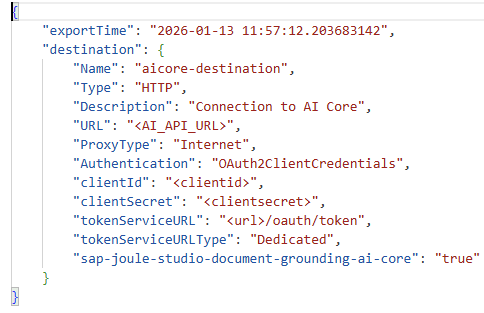  

2. Edit the destination using the key of your SAP AI Core instance.

    <!-- border -->
    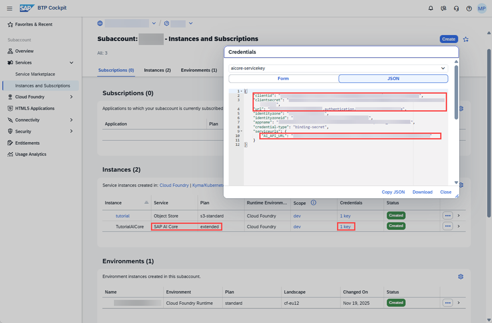

3. In the BTP Cockpit of your Joule Studio subaccount, go to **Connectivity** > **Destinations**.

4. Choose **Create** and import your edited json file. 

    <!-- border -->
    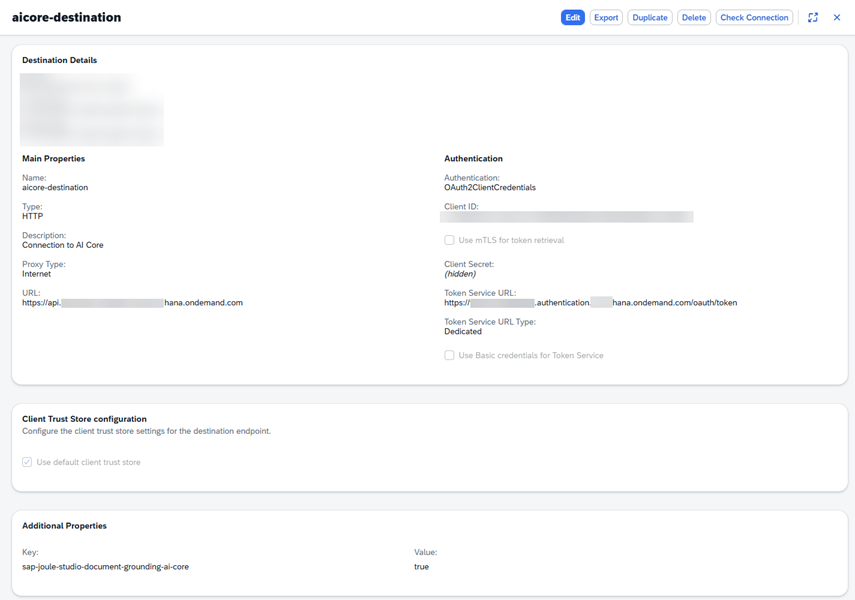

5. Choose **Check Connection**.

    <!-- border -->
    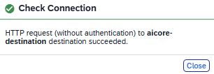

6. In the BTP Cockpit of your Joule subaccount, go to **Connectivity** > **Destinations**.

7. Choose **Create** and import your edited json file. 

8. Choose **Check Connection**.

### Create a Destination for the S3 Object Store

1. Download the destination [spba-s3-object-store-destination.json](https://github.com/sap-tutorials/sap-build-process-automation/blob/main/tutorials/joulestudio-document-grounding/spba-s3-object-store-destination.json)

    The json file contains placeholders that you will need to replace.

    <!-- border -->
    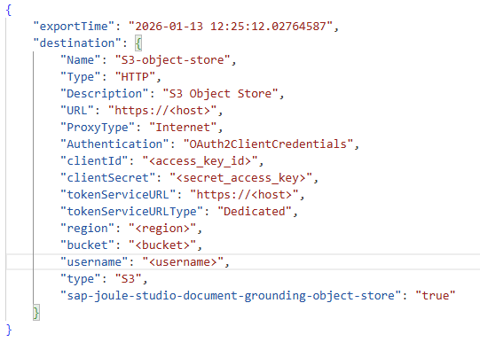 

2. Edit the destination using the key of your SAP AI Core instance.

    <!-- border -->
    

3. In the BTP Cockpit of your Joule Studio subaccount, go to **Connectivity** > **Destinations**.

4. Choose **Create** and import your edited json file. 

    <!-- border -->
    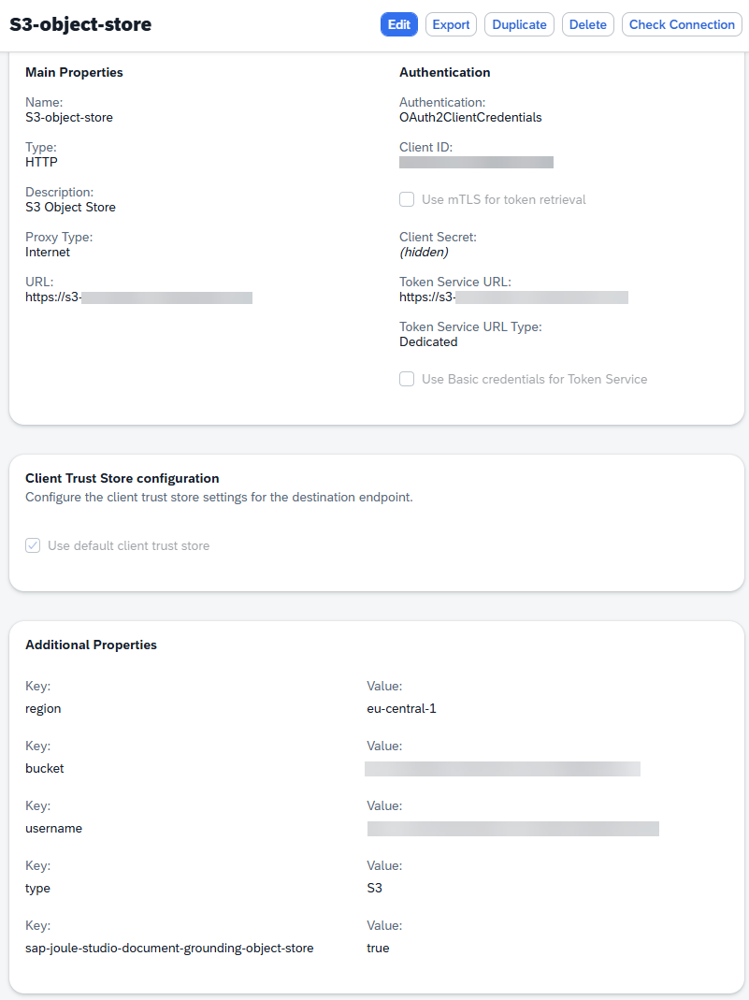

5. Choose **Check Connection**.

    <!-- border -->
    

### Configure Document Grounding

The object stores that document grounding tools will have access to are maintained here. The entity called resource group here is not the same as a resource group in SAP AI Core, though one will be created there among other things.

1. In the **Lobby** of Joule Studio, choose **Control Tower** > **Document Grounding**.

    <!-- border -->
    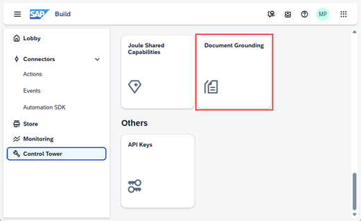
    
    <!-- border -->
    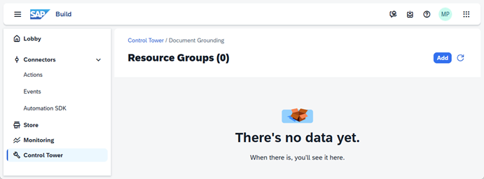

2. Choose **Add**.

3. Enter a name and choose **Next**.

    <!-- border -->
    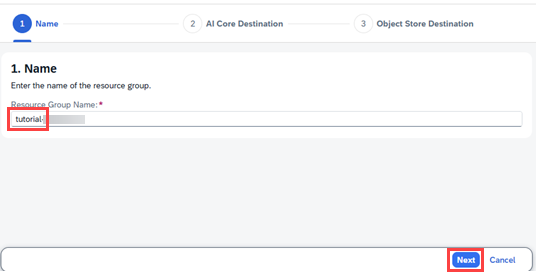

3. Select your AI Core destination and choose **Next**.

    <!-- border -->
    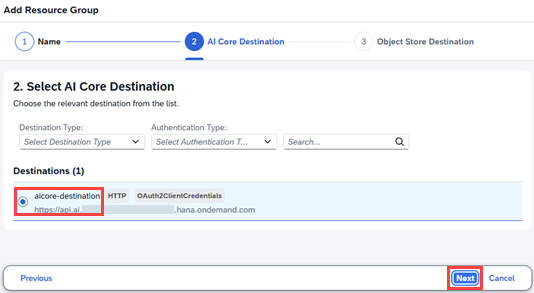

4. Select the S3 Object Store destination and choose **Add**.

    <!-- border -->
    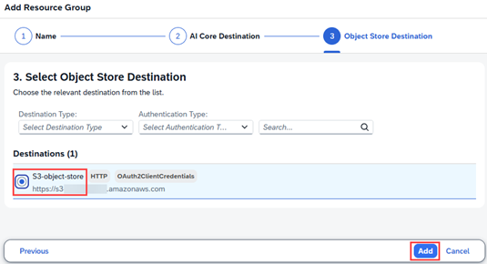

5. Wait until the **Status** changes from **Pending** to **Completed**. This can take some time. Refresh the browser to check.

    You might see the status starting with **Error** and perhaps later before **Completed** is reached. Don't panic - give it time.

    <!-- border -->
    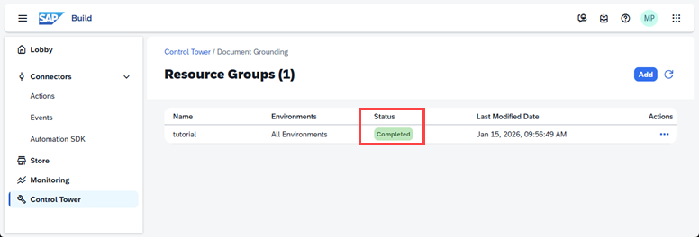


### Create an Agent

You will extend the project that you completed in the previous tutorial.

1. In the **Lobby** of Joule Studio, navigate to **Versions** of your project and choose **Save as New Project**.

    <!-- border -->
    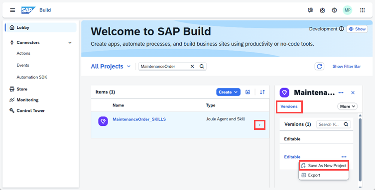

2. Give it a name and then open the new project.

3. Choose **Create** -> **Joule Agent**.

    You could enhance your existing validation agent with document grounding later, but here we intentionally keep them distinct — to show how grounding works for learning purposes.

    <!-- border -->
    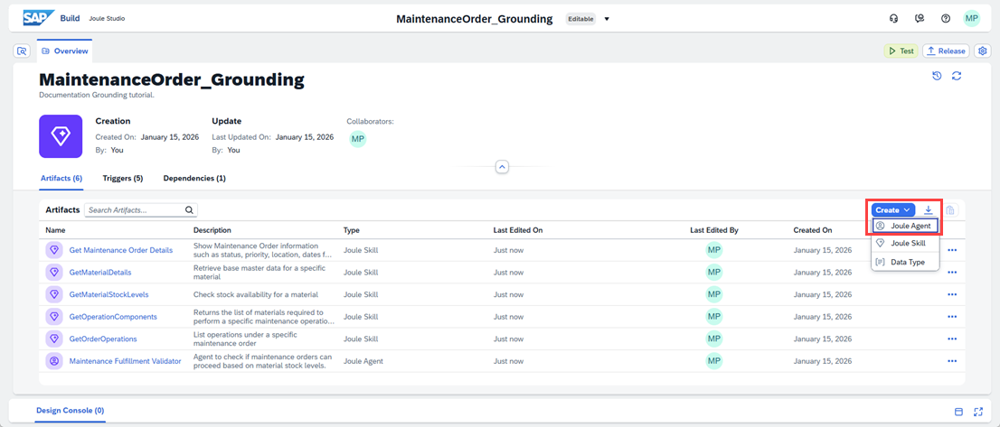

4. Enter the name **`Maintenance Compliance Agent`** and description  **`Helps users understand, assess, and troubleshoot maintenance policies to ensure correct execution`**, then choose **Create**.

    <!-- border -->
    

5. Add the following text to **Expertise**: 

    ```
    Help users understand, assess, and troubleshoot the executability of maintenance orders.
    ```

6. Add the following text to **Instructions**: 

    ```
    This agent is trained to support, validate, and guide users through maintenance orders based on the following two internal documents:
    Component Management Guidelines in Maintenance Orders
    Business Guidelines for Validating Maintenance Order Executability

    It behaves like a skilled maintenance planner, applying domain logic and SAP system rules (PM module) to assess:
    Order status, Operation structure, Component availability, Common data issues, Edge cases requiring human review
    ```

    <!-- border -->
    


7. Choose the **Add Tool** dropdown in the top right corner of the Tools section. From the menu, select **Documents**. 

    <!-- border -->
    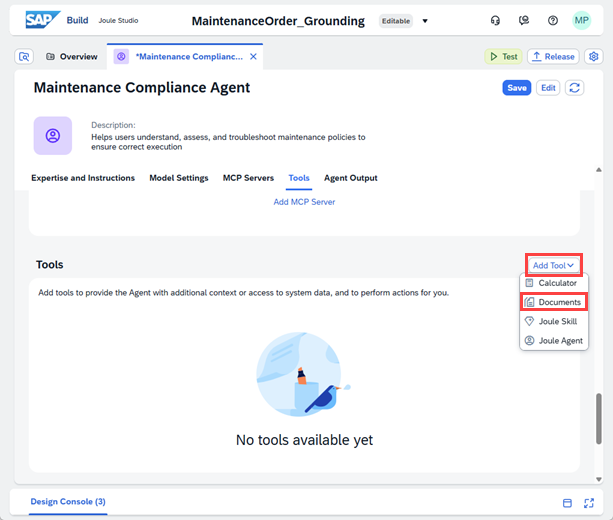

    Enter the name **`Order Validation Documents`** and description **`Internal guidelines required by the agent to validate and guide users through maintenance orders. It covers component assignment rules, stock validation logic, operational status checks, and exception handling — based on SAP PM best practices.`**
    
    Select the resource group name that you configured earlier, then choose **Add**.

    <!-- border -->
    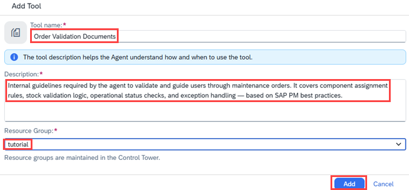 

8. Choose **Save**.

    <!-- border -->
    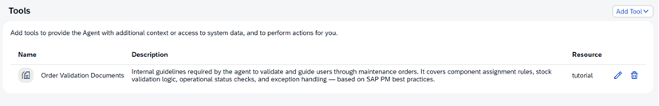 


### Test in Private Environment

1. Choose **Test** in the agent editor.

2. Configure the test parameters by selecting your private environment and your destination from the previous tutorial. Then choose **Continue**.

3. Enter the prompt: **Can you give me a short summary of our Maintenance Order Compliance policy, highlighting the main dos and don’ts?** and choose **Send**.

    <!-- border -->
    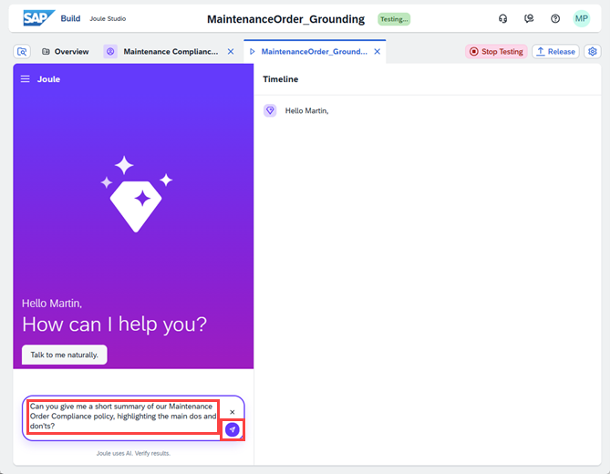 

    Joule should respond with something similar to the following.

    <!-- border -->
     

    The results can vary from run to run. You might need additional prompts if the LLM does not understand or requires further clarification.

4. Enter the prompt: **Is it a policy violation to execute or release a maintenance order that is only partially confirmed? Please explain the conditions when this is allowed or not, referencing the policy.** and choose **Send**.

    <!-- border -->
    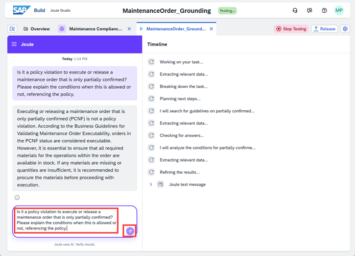 

5. Under **Timeline**, expand the nodes and see how Joule processed your request.

    <!-- border -->
    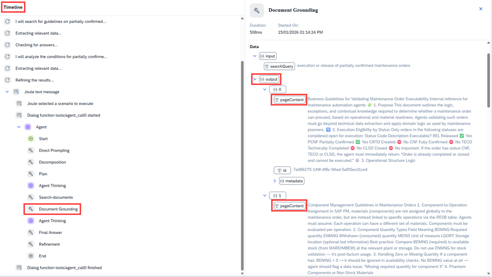 

6. Choose **Stop Testing**.


### Test yourself