# Create a Filter in an Action Project
<!-- description --> Create a filter in an action project to simplify the use of the OData service in Joule Studio.

## Prerequisites

- Access to an SAP BTP tenant configured for Joule and Joule Studio
- You have [configured the destinations to the OData services](joulestudio-skill-environment-setup)
- You have [created and configured the action projects](joulestudio-skill-action-create)

## You will learn
  - How to adjust the input of an action and create a custom filter
  - How to use the filter in a Joule skill
  - How to get Joule to automatically generate the conversation message

### Copy action project for BusinessPartner service

1. Open **SAP Build Lobby**.

    > The lobby is a central page for creating, accessing, and managing your projects in SAP Build.

2. Choose **Connectors**, then choose **Actions**.

    <!-- border -->
    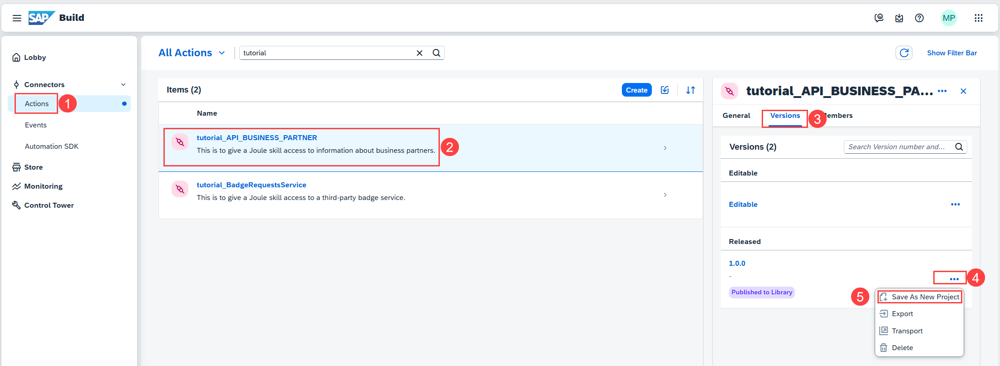

3. Select your API_BUSINESS_PARTNER action project, then choose **Versions**.

4. Choose **…** by the **Published to Library** version, then choose **Save As New Project**.

    <!-- border -->
    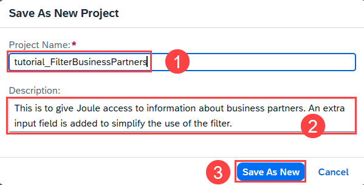

5. Enter:
    - **`FilterBusinessPartners`** for the **Project Name**.
    - **`This is to give Joule access to information about business partners. An extra input field is added to simplify the use of the filter.`** for the **Description**.

6. Choose **Save As New**.

    <!-- border -->
    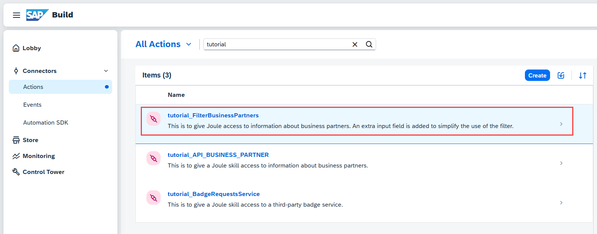

7. Choose the new project.

    <!-- border -->
    

8. Choose the **GET Retrieves business partner general data** action.

9. On the **Input** tab, choose **Add**.

    <!-- border -->
    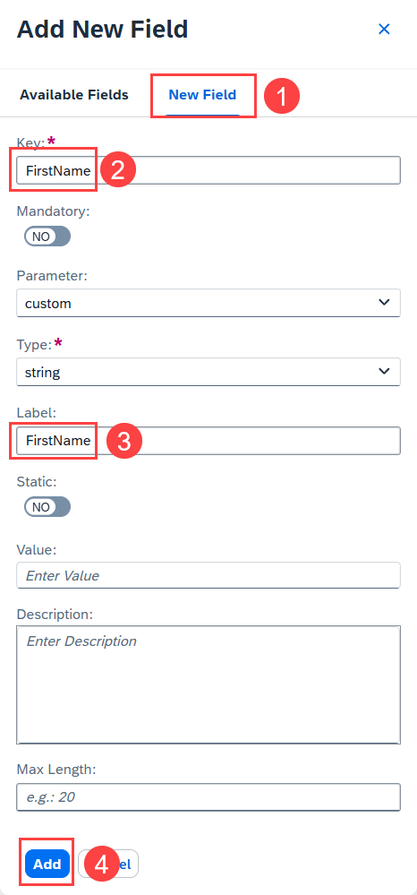

10. Choose **New Field**.

11. Enter **`FirstName`** as the **Key** and the **Label**, then choose **Add**.

12. Choose the **Value** field of **$filter**.

    <!-- border -->
    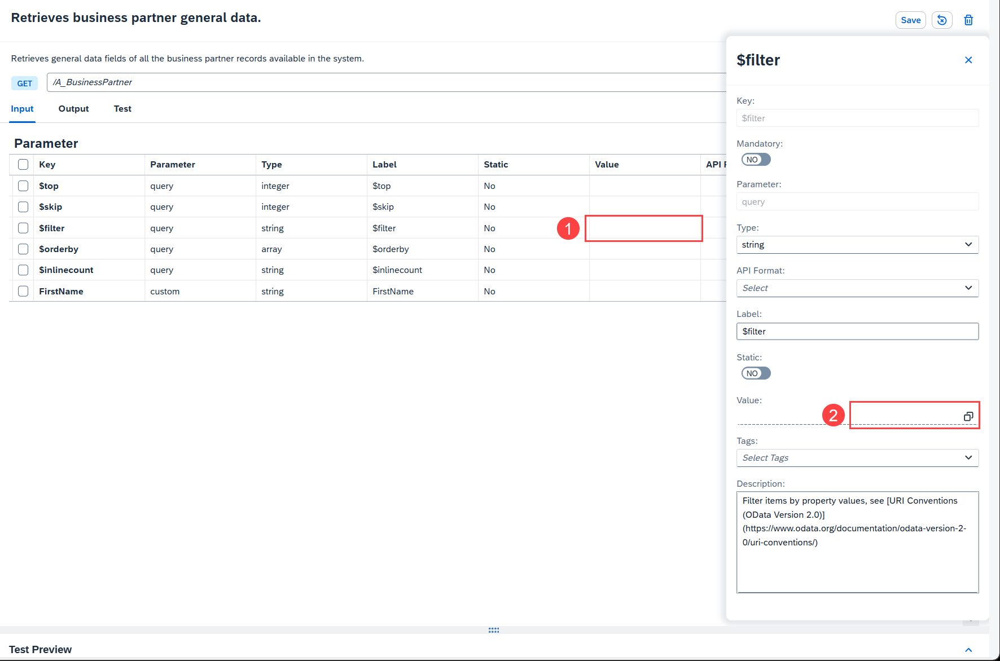

13. In the side panel **$filter**, choose the **Value** field to open the **Condition Editor**.

     <!-- border -->
     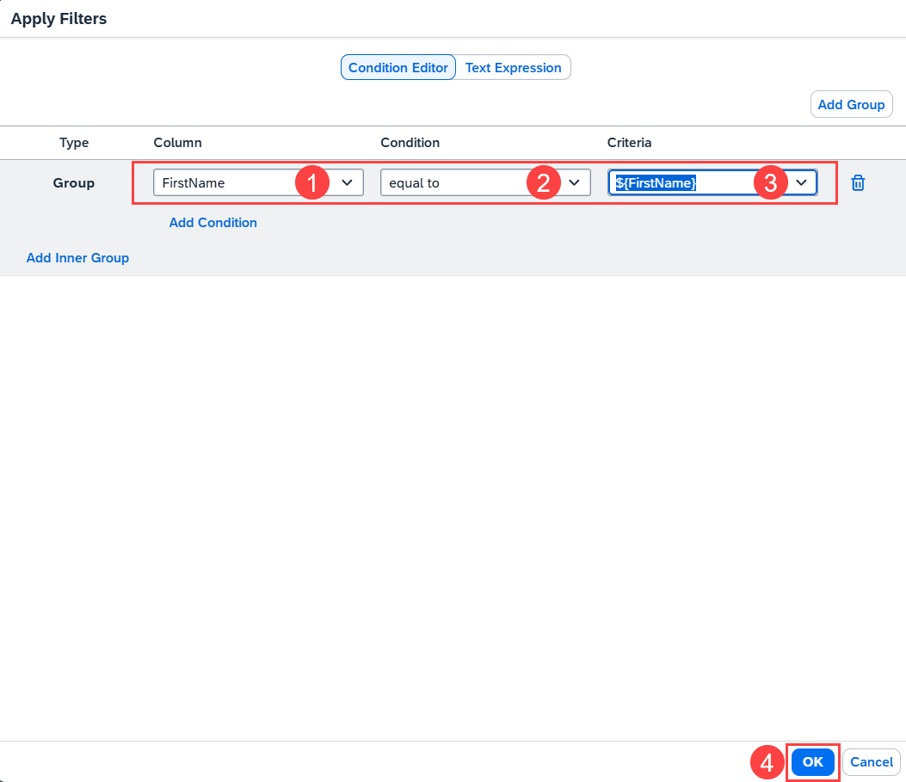

14. For **Column**, **Condition**, and **Criteria**, select **`FirstName`**, **`equal to`**, and **`${FirstName}`** respectively. Then choose choose **OK**.

15. Choose the **Test** tab.

16. Enter **`Jane`** in the **FirstName** field, then choose **Test**.

     <!-- border -->
     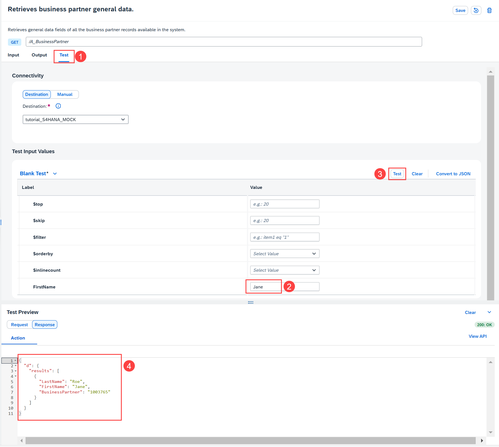

17. Choose **Save**, then **Release**, and finally **Publish**.

     <!-- border -->
     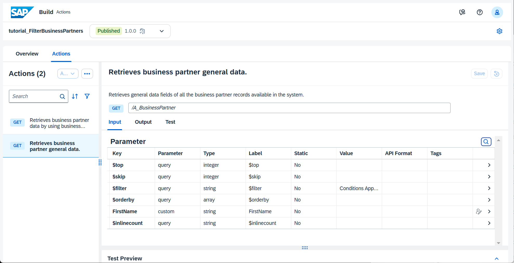

### Create a Joule Skill 

1. Go to the **SAP Build Lobby**

    <!-- border -->
    

2. Choose **Create**.

    <!-- border -->
    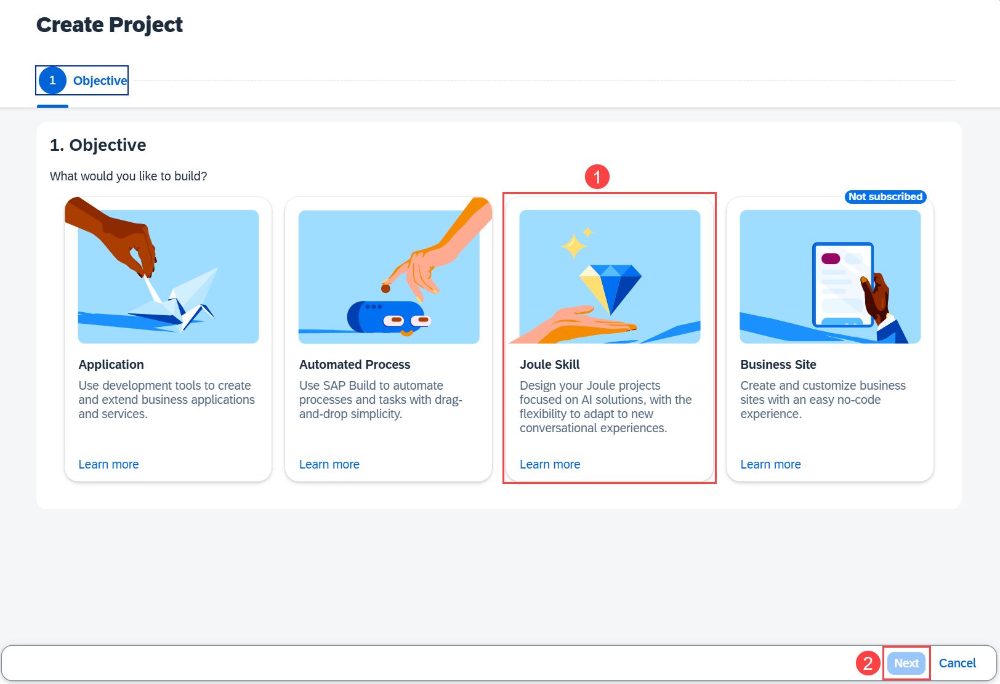

3. Choose **Joule Skill**, then choose **Next**.

4. Enter name **`SearchWithName`** and description **`Uses an Action containing a mapped condition to filter on the FirstName.`**.

    <!-- border -->
    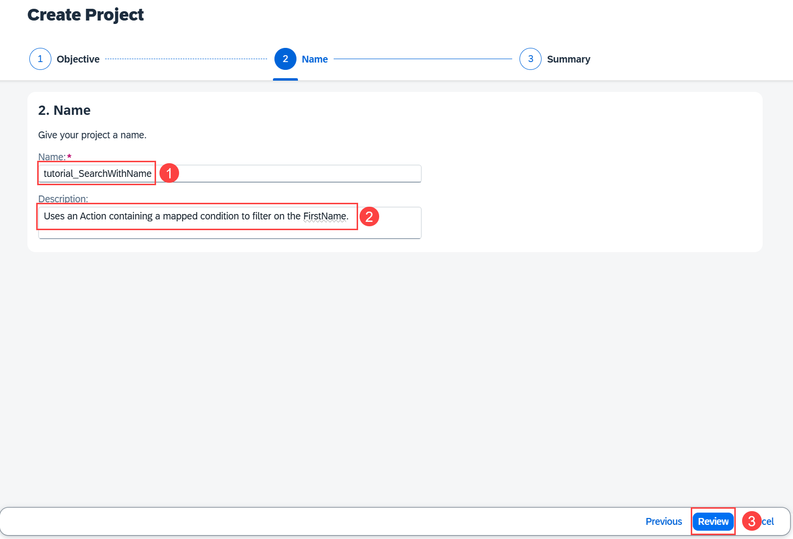

5. Choose **Review**, then choose **Create**.

6. In Joule Studio, choose **Create** **>** **Joule Skill**.

    <!-- border -->
    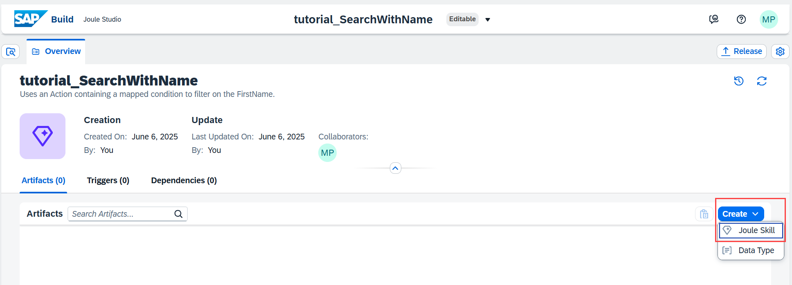

7. Enter:
    - **`SearchWithFirstName`** for **Name**.
    - **`Retrieve information about employees with a given first name. Usually John or Jane is used`** for **Description**.

    <!-- border -->
    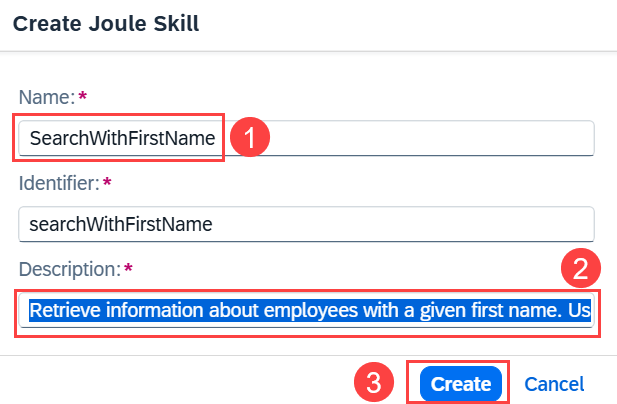

8. Choose **Create**.

9. Choose **Trigger** to open the side panel.

10. Enable **Allow Joule to generate a response**.

    <!-- border -->
    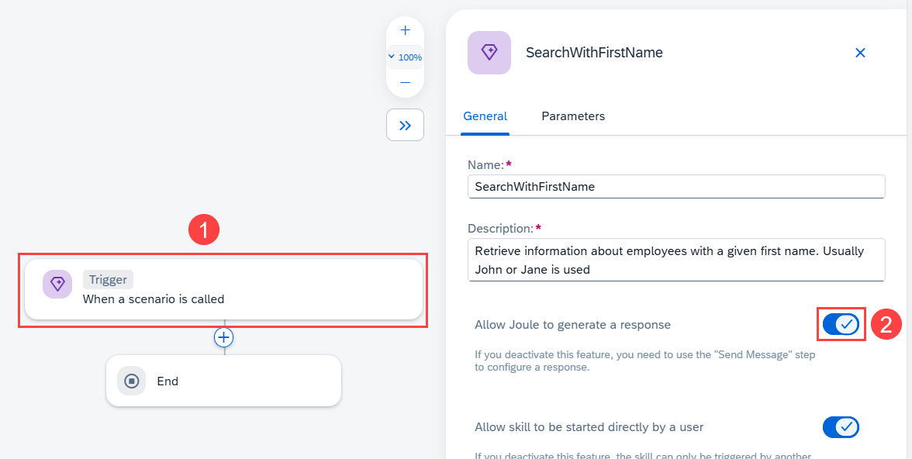

11. Choose **Parameters**, then choose **Configure** beside **Skill Inputs**.

    <!-- border -->
    

12. Choose **Add Input**. Enter **`FirstName`** for **Name**, **`First name of employee`** for **Description**, and select **Required**.

    <!-- border -->
    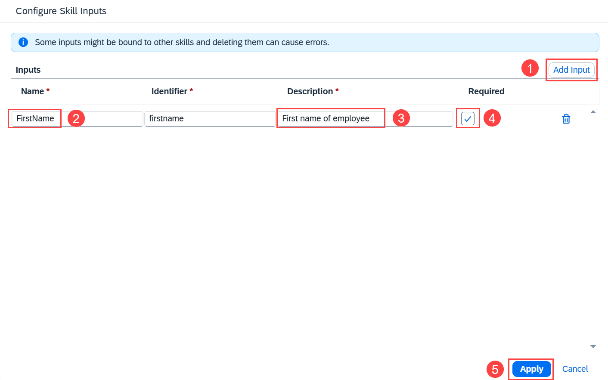

13. Choose **Apply**

14. Choose **Configure** beside **Skill Outputs**.

    <!-- border -->
    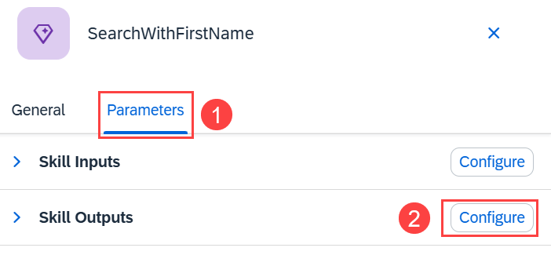

15. Choose **Add Output**

16. Enter: 
    - **Name** **`Employees`** 
    - **Description** **`Employees`** 
    - **Type** **`Any`**
    - **List** **`Select`**

    <!-- border -->
    

17. Choose **Apply**.

15. Close the side pane and choose **Save**.

### Add Action to Joule Skill 

1. Choose the **+**.

    <!-- border -->
    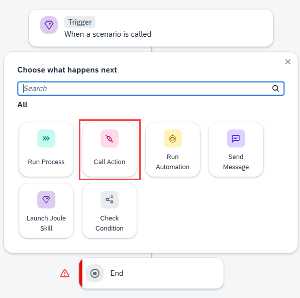

2. Choose **Action**.

    <!-- border -->
    

3. Choose **Browse All Actions**.

    <!-- border -->
    

4. Select the **GET Retrieves business partner general data** action of the project **FilterBusinessPartners** and choose **Add** beside it. 

5. Choose **Select a Destination Variable**, then **+ Create Destination Variable**.

6. Enter **`S4HANA_MOCK`** and **`BusinessPartner API`**, followed by **Create**.

    <!-- border -->
    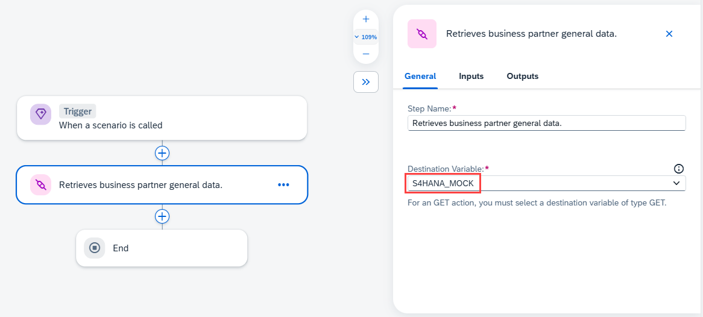

7. Select the destination variable.

8. Choose the **Inputs** tab.

9. Choose the **FirstName** field to open the **Skill Content** pane.

10. Choose **FirstName** in the **Skill Content** pane to map to the selected **FirstName** field.

    <!-- border -->
    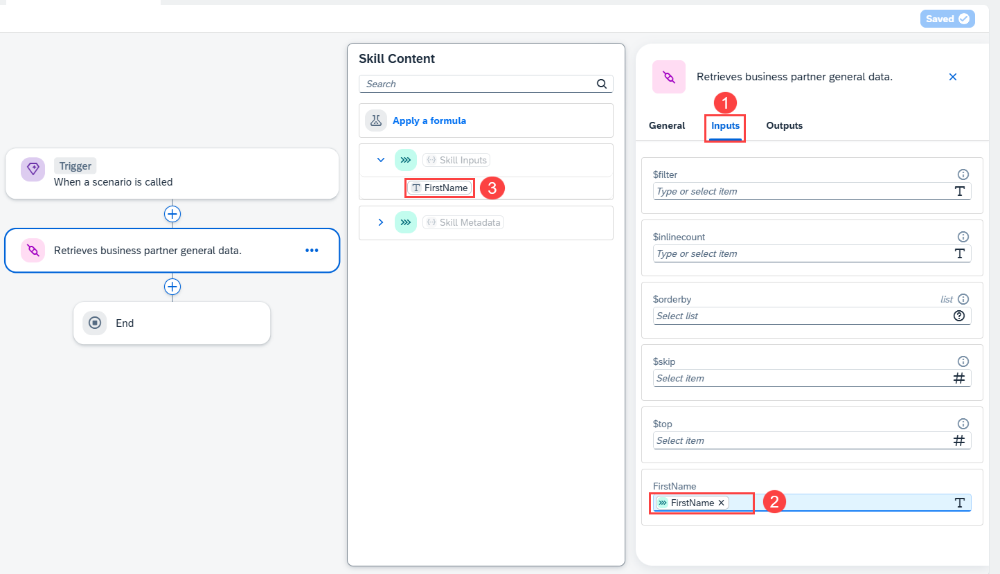

11. Choose the **Outputs** tab just to see the output.

    <!-- border -->
    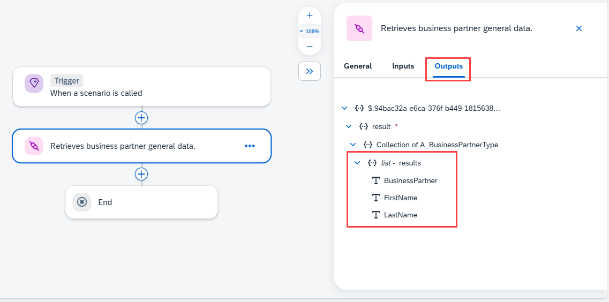

12. Close the pane and choose **Save**.

### Configure End

1. Choose the **End** element.

2. Choose the **Employees** field to open the **Skill Content** pane.

22. Choose **{..} list - results**.

    <!-- border -->
    

23. Choose **Save**.

### Release and Deploy

1. Choose **Release**.

    <!-- border -->
    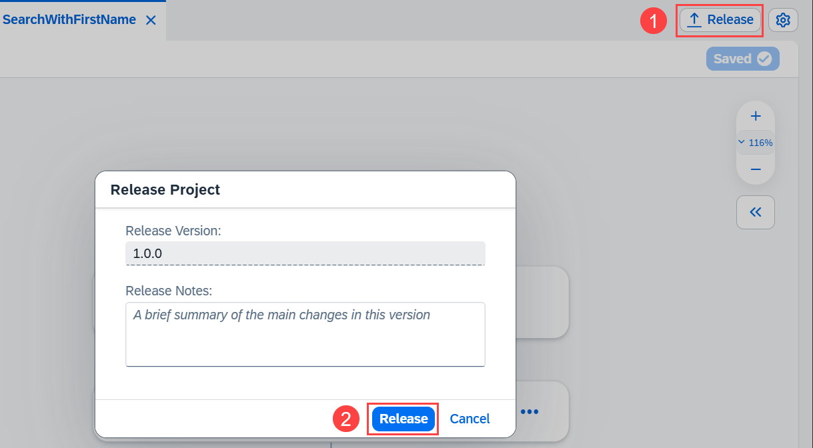

2. Choose **Release**.

    <!-- border -->
    

3. Choose **Show project version**, to change to the released version.

4. Choose **Deploy**.

    <!-- border -->
    

5. Select your environment and choose **Deploy**.

6. Select your **S4HANA_MOCK** destination and choose **Deploy**.

    <!-- border -->
    

### Test Joule Skill
1. Open the **SAP Build Lobby**

2. Choose **Control Tower**, then choose the **Environments** tile.

3. Choose your environment.

4. Choose the **Joule** tab.

    <!-- border -->
    

5. Choose **Launch**.

    <!-- border -->
    

6. Choose **New Conversation**.

7. Enter **`I am at the front desk in the reception area. A person claiming to be an employee is here. Can you check if Jane is in the system?`** 

    <!-- border -->
    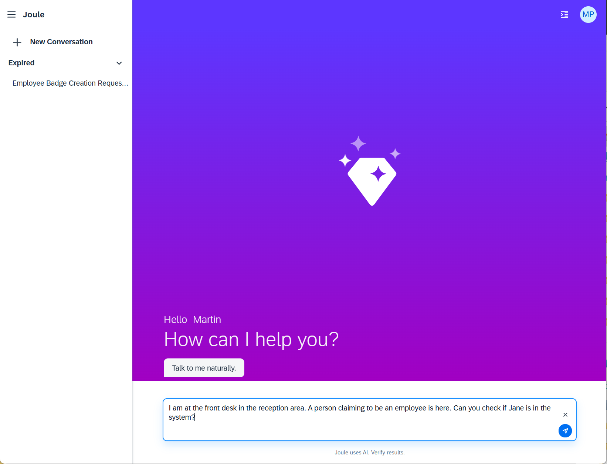

8. Choose **Send**.

    <!-- border -->
    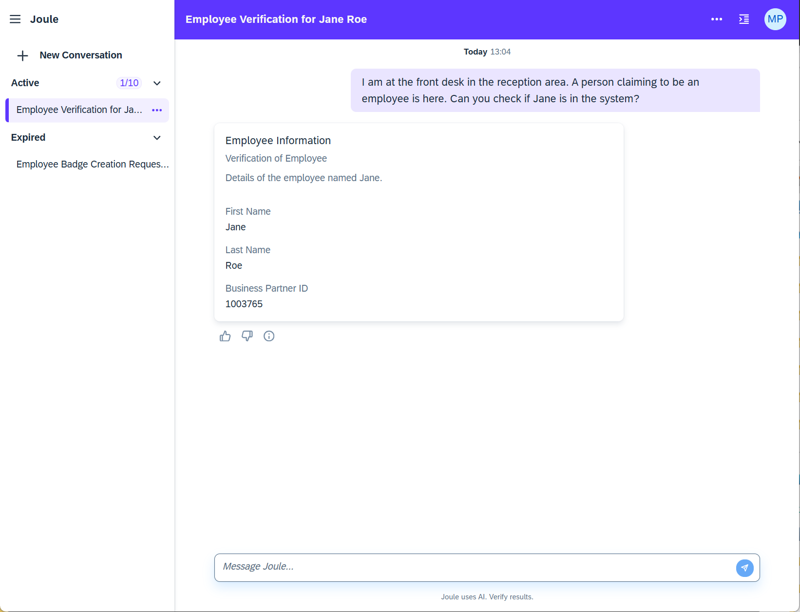

9. Enter **`Thanks, I meant you to check if John is in the system.`**, then choose **Send**.

    <!-- border -->
    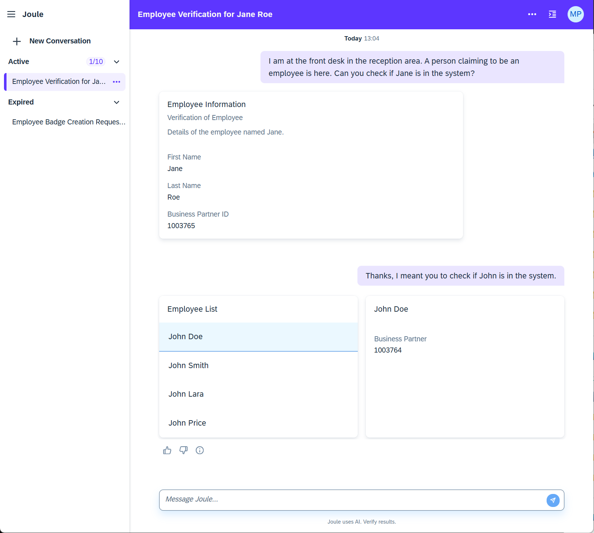

10. You can select any of the employees in the list to see their details.

### Test yourself

